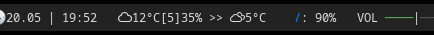

Weather forecast



### Setup

TODO

### Providers
* [yandex](https://yandex.ru/dev/weather/doc/dg/concepts/forecast-info.html)

### Configuration (yandex)

Location `$HOME/.config/forecast/config.toml`

```toml
# yandex 
provider = "Yandex"

# Output format
display = "{{ condition_icon }}{{ temperature_celsius_full }}[{{ feel_temperature_celsius }}]{{ humidity }}% >> {{ forecast_0_condition_icon }}{{ forecast_0_temperature_celsius_full }} "
[cache]
enabled = true
expiration = "30m"


[yandex]
api_key = "YOUR_API_KEY"
lat = "57.1522"
lon = "65.5272"
lang = "en_EN"
user_agent = "Mozilla/5.0 (X11; Linux x86_64; rv:60.0) Gecko/20100101 Firefox/81.0"

```


### Polybar
You can define your new module like this:

```
...
[bar/example]
font-3 = weathericons:size=10;2
modules-center = weather
...

[module/weather]
type = custom/script
exec-if = ping api.weather.yandex.ru -c 1
exec = /path/to/polybar-forecast
interval = 300
label-font = 3 
click-left = xdg-open https://yandex.ru/pogoda/?utm_source=home&utm_content=main_informer&utm_campaign=informer&utm_medium=web&utm_term=main_number
```